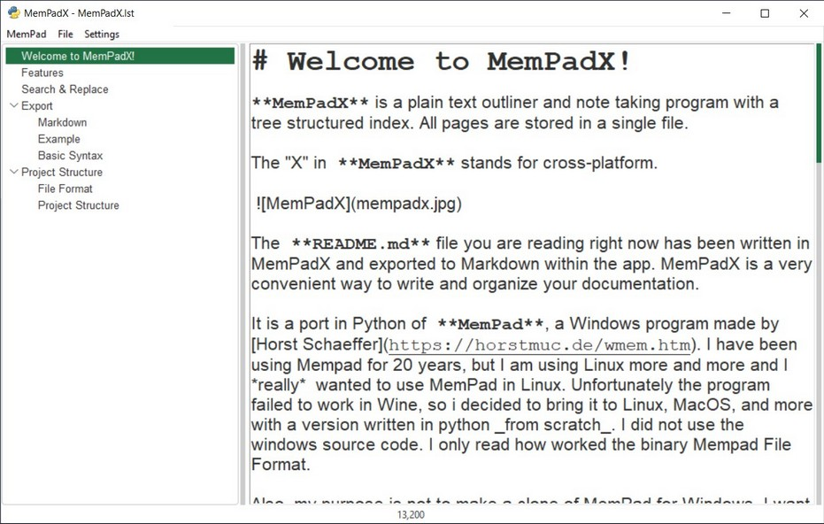
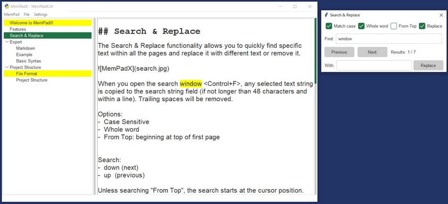

# MemPadX

## Welcome to MemPadX!

**MemPadX** is a plain text outliner and note taking program with a tree structured index. All pages are stored in a single file. 

The "X" in **MemPadX** stands for cross-platform.  
   
 

The **README.md** file you are reading right now has been written in MemPadX and exported to Markdown within the app. MemPadX is a very convenient way to write and organize your documentation.
 
It is a port in Python of **MemPad**, a Windows program made by 
[Horst Schaeffer](https://horstmuc.de/wmem.htm). I have been using Mempad for 20 years, but I am using Linux more and more and I *really*  wanted to use MemPad in Linux. Unfortunately the program  failed to work in Wine, so i decided to bring it to Linux, MacOS, and more with a version written in python _from scratch_. I did not use the windows source code. I only read how worked the binary Mempad File Format.

Also, my purpose is not to make a clone of MemPad for Windows. I want more. For example, I added the possibility to display a subset of Markdown: titles, bold, italics links are displayed as you type.

## Features

Editing functions

- Copy, cut, paste, undo/redo...
- Open files with drag&drop or menu
- Keep a fast access of the 10 latest mempad files
- Save without prompting when you quit or open another mempad file
- An Auto-Save option (every 5 minutes) is available in settings.
- Designed as a "portable" program. 
- Search & Replace specific text within all pages.
- Render basic markdown as you type (titles, bold...)
- Export to plain text, Markdown and to HTML.

Tree structure:

- Select a page with a single mouse click or by cursor control.
- Nodes can be added, renamed, or deleted with the right-click menu
- Drag&drop nodes to modify the tree structure.  
- Double-click on an item to rename the page title.

Settings are stored in the **settings.ini** file
Settings can be changed in the Settings menu:

- No Backup : no backup at opening file
- ESC shortcut to quit.
- Auto Save every 5 minutes.
- Keep the app always on Top

## Search & Replace
The Search & Replace functionality allows you to quickly find specific text within all the pages and replace it with different text or remove it. 



When you open the search window **Control+F**, any selected text string is copied to the search string field (if not longer than 48 characters and within a line). Trailing spaces will be removed. 

Options:
-  Case Sensitive
-  Whole word
-  From Top: beginning at top of first page 


Search:
-  down (next)
-  up  (previous) 

Unless searching "From Top", the search starts at the cursor position.

To continue the search :

to go forward: click the next button, or the **down arrow** or **Return**. 
to go backward:  click the previous button, or the up arrow or **Ctrl+Return**. 

An automatic "reset" is done, when the search string is changed, or an option is change.  

If you press Ctrl+F when the search window is open, it closes it, so it it is like a toggle.


## Replace

You can replace a string with any other string or with nothing. 
Make sure you click the checkbox "Replace" in the option.

To start a search & replace operation, first find the first instance (as seen above).

To replace the text, press the Replace button or **Ctrl+R**.
You will see  the result of the replacement, before you decide to continue to search "Down" (or "Up"). 

You can use Control+R instead of the "Replace" button

It is not possible to replace strings in the index structure.

## Export

MemPadX files can be exported to plain text, Markdown and to HTML.

add_page_title : The title in the tree view will be added as the title
autotitle : in the case of export to one page, the title level will be corrected. 

For example "Export" is a level_1 menu and "What is Markdown" a level_2 menu.
When exporting one file, they will be rendered like this :

- exported to Markdown:

    # Export
    ## What is Markdown


-  exported to HTML:

    <h1>Export</h1>
    <h2>What is Markdown</h2>


You can insert Markdown in any page, it is supported out-of-the-box.

### Markdown

**Markdown** is a lightweight markup language with plain text formatting syntax designed to make writing for the internet easier. Created by John Gruber in 2004, Markdown allows users to format text using simple, human-readable annotations that can be converted into HTML and other formats. It is widely used for creating rich text documents, writing posts for blogs, formatting readme files, and generating content for websites. Its simplicity and readability, even in raw form, make it a popular choice for developers, writers, and anyone needing to produce formatted text quickly and efficiently.

### Basic Syntax

These following elements form the core of Markdown's syntax, enabling you to create well-structured and readable documents with ease.
 
1. **Headings**: Use `#` for headers. The number of `#` symbols indicates the level of the heading.
   ```markdown
   # Heading 1
   ## Heading 2
   ### Heading 3
   ```

2. **Emphasis**: Use asterisks or underscores for emphasis.
   - *Italic*: `*italic*` or `_italic_`
   - **Bold**: `**bold**` or `__bold__`
   - ***Bold and italic***: `***bold and italic***` or `___bold and italic___`

3. **Lists**:
   - **Unordered lists**: Use `-`, `*`, or `+` for bullets.
     ```markdown
     - Item 1
     - Item 2
     ```
   - **Ordered lists**: Use numbers followed by a period.
     ```markdown
     1. Item 1
     2. Item 2
     ```

4. **Links**: Use `[text](url)`.
   ```markdown
   [OpenAI](https://www.openai.com)
   ```

5. **Images**: Use ``.
   ```markdown
   
   ```

6. **Blockquotes**: Use `>` at the beginning of a line.
   ```markdown
   > This is a blockquote.
   ```

7. **Code**:
   - Inline code: Use backticks `` `code` ``
   - Code blocks: Use triple backticks or indent with four spaces.
     ```markdown
     ```
     def hello():
         print("Hello, world!")
     ```
     ```

8. **Horizontal Rule**: Use three or more `-`, `*`, or `_`.
   ```markdown
   ---
   ```

9. **Tables**: Use `|` to separate columns and `-` to create the header row.
   ```markdown
   | Header 1 | Header 2 |
   |----------|----------|
   | Row 1 Col 1 | Row 1 Col 2 |
   | Row 2 Col 1 | Row 2 Col 2 |
   ```

## Project Structure

Here are some notes if you want to know more about the projects.

### File Format

# MemPad File Format 

Here is the FileFormat used by MemPad for Python. 
The python version uses the "New 3.++" format  of MemPad for Windows with UTF8 support only.

File header              

    header:           string
        Magic Number         constant "MeMpAd." 
        encoding      character, " " means Ansi, "." means UTF-8 file.
        initial page  number to select at start (max. 5 characters)
        
    quick page path:  string (may be empty)


For each Page:

    level:            byte, binary 1..99 
    
    page title:       string (max 64 characters);
                      if a TAB character is found, the rest of the string
                      contains additional header information, currently the
                      background color code ($nnnnnn) 
                      
    page contents:    string 


Note: If the "MeMpAd " signature at the beginning of the file is not found, Mempad for windows assumes that this file is encrypted, and asks for the password. The Python version does not support it yet, so opening such a file will fail.

### Project Structure

The MVC Project Structure gives a well-organized application with a clean separation of concerns. The main view combines several subviews, each responsible for a part of the UI. The controller handles interactions and logic, keeping the model and view decoupled.

```
mempadx/
├── controllers/
│   ├── __init__.py
│   ├── app_controller.py
├── models/
│   ├── __init__.py
│   ├── page_model.py
├── views/
│   ├── __init__.py
│   ├── main_view.py
│   ├── menu_view.py
│   ├── toolbar_view.py
│   ├── treeview_view.py
│   ├── textarea_view.py
│   ├── footer_view.py
├── resources/
│   ├── ...
├── main.py
└── README.md
```

